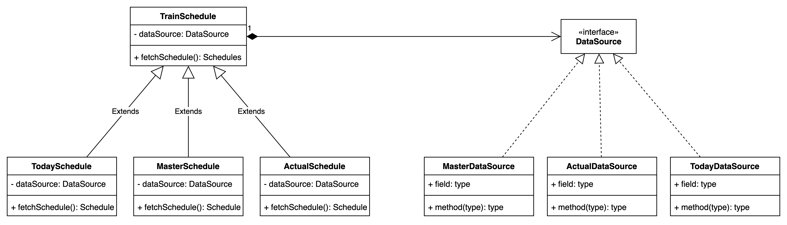

Definition:
“Define a family of algorithms, encapsulate each one, and make them interchangeable. Strategy lets the algorithm vary 
independently from clients that use it.”

Excerpt From
Design Patterns: Elements of Reusable Object-Oriented Software
Gamma, Erich
This material may be protected by copyright

Study Case:
The Train Schedule has three types of schedules, namely the actual schedule, master schedule, and today's schedule. 
the difference between these schedules lies in how the data is retrieved in the database

Desain:

